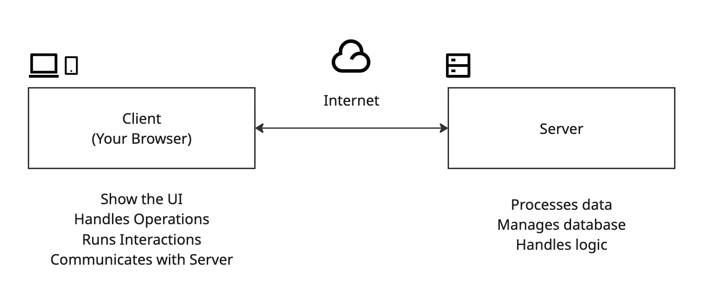
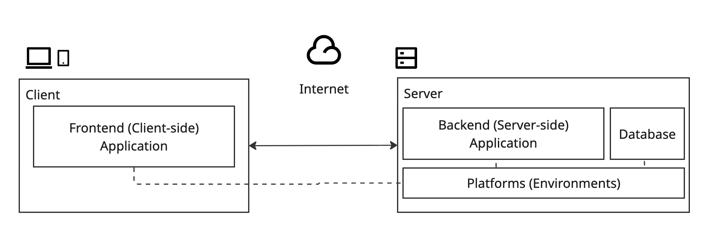
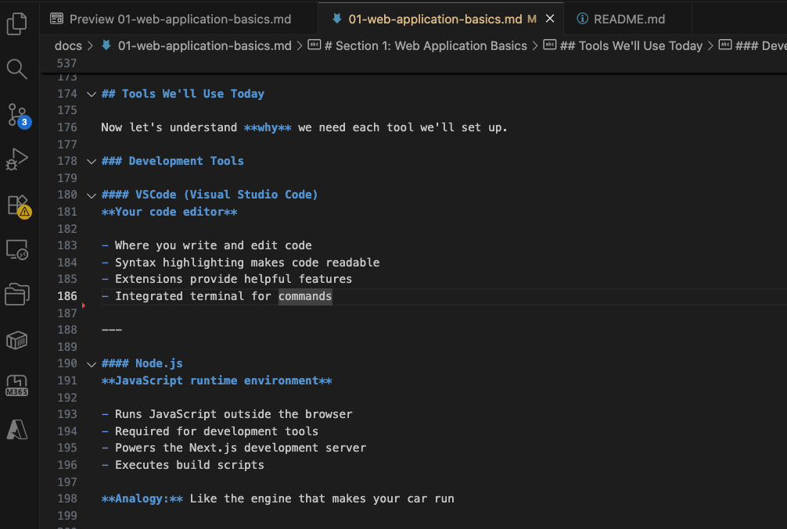
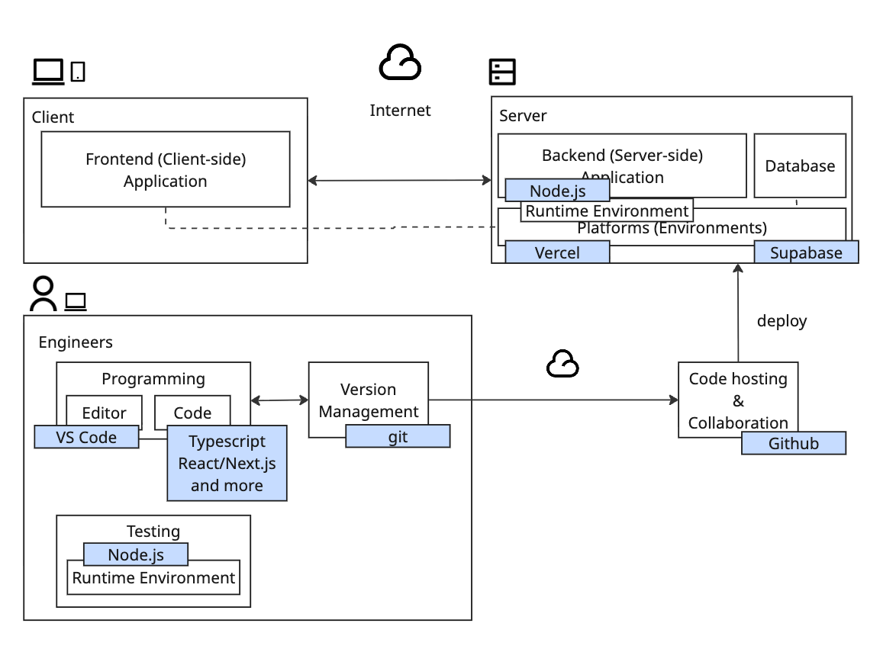

# Section 1: Web Application Basics

## Overview

- Understand what web applications are
- Learn the client-server model
- Identify the key components of web applications
- Understand the role of each tool we'll use today

## What is a Web Application?

### Definition

A **web application** is a software application that runs in a web browser and is accessed over the internet.

### Familiar Examples

You use web applications every day:

- **X (Twitter)** - Social media platform
- **Gmail** - Email service
- **Notion** - Note-taking and collaboration
- **YouTube** - Video streaming
- **Google Docs** - Document editing
- **Spotify Web Player** - Music streaming
- **Netflix** - Movie streaming
- **GitHub** - Code hosting

### Web Applications vs. Websites

| Web Application | Traditional Website |
|-----------------|---------------------|
| Interactive | Mostly static |
| Processes data | Displays information |
| Requires user login (often) | Usually public |
| Personalized experience | Same for everyone |
| **Example: Gmail** | **Example: News article** |

**Note:** The line is often blurred - many modern websites have application features!

## How Web Applications Work

### The Client-Server Model


### Request-Response Cycle

1. **You interact** with the browser (click a button, submit a form)
2. **Browser sends a request** to the server over the internet
3. **Server processes** the request (queries database, performs calculations)
4. **Server sends a response** back to the browser
5. **Browser updates** the display with new information

## Key Components of Web Applications

Every modern web application has these main parts:

### 1. Frontend (Client-Side) Application

**What users see and interact with**

```
┌──────────────────────────────┐
│  Frontend                    │
│                              │
│  • Visual interface (UI)     │
│  • Buttons, forms, images    │
│  • Animations and effects    │
│  • Responds to user actions  │
│                              │
│  Technologies:               │
│  HTML, CSS,                  │
│  JavaScript, TypeScript      │
│  React, Next.js              │
└──────────────────────────────┘
```

**Examples:**
- The X tweet composition box
- Gmail's email list and reading pane
- Notion's drag-and-drop interface

### 2. Backend (Server-Side)

**The logic and data processing**

```
┌──────────────────────────────┐
│  Backend (API)               │
│                              │
│  • Processes requests        │
│  • User authentication       │
│  • Data management           │
│  • Business logic            │
│                              │
│  Technologies:               │
│  Next.js API Routes          │
│  Server functions            │
└──────────────────────────────┘
```

**Examples:**
- X checking if you're logged in
- Gmail sending your email to recipients
- Notion saving your document edits

### 3. Database

**Where data is stored permanently**

```
┌──────────────────────────────┐
│  Database                    │
│                              │
│  • Stores user data          │
│  • Stores application data   │
│  • Allows queries            │
│  • Ensures data persistence  │
│                              │
│  Technologies:               │
│  PostgreSQL.                 │
└──────────────────────────────┘
```

**Examples:**
- X storing all posts, likes, follows
- Gmail storing all your emails
- Notion storing all your documents and pages

### 4. Platform (Environment)

**Where the application lives on the internet**

```
┌──────────────────────────────┐
│  Deployment Platform         │
│                              │
│  • Hosts your application    │
│  • Provides a URL            │
│  • Handles scaling           │
│  • Manages servers           │
│                              │
│  Technologies:               │
│  Vercel for Next.js apps     │
│  Supabase for database       │
└──────────────────────────────┘
```

## Complete Picture

Every modern web application has two main parts:
- Frontend(Client-side) Application
- Backend(Server-side) Application
  - The backend often requires a database.

Every parts require a platform as their runtime environment.




### Example Flow: Adding a Pet to Your App

1. **Frontend:** User fills out a form (pet name, species, age) and clicks "Add Pet"
2. **Frontend → Backend:** Browser sends the data to your API
3. **Backend:** Validates the data (is the age a number? is name not empty?)
4. **Backend → Database:** Saves the new pet to Supabase
5. **Database → Backend:** Confirms the pet was saved successfully
6. **Backend → Frontend:** Sends success response
7. **Frontend:** Updates the screen to show the new pet in the list

## Tools We'll Use Today

Now let's understand **why** we need each tool we'll set up.

### Development Tools

#### VSCode (Visual Studio Code)
**Your code editor**

- Where you write and edit code
- Syntax highlighting makes code readable
- Extensions provide helpful features
- Integrated terminal for commands



---

#### Node.js
**JavaScript runtime environment**

- Runs JavaScript outside the browser
- Required for development tools
- Powers the Next.js development server
- Executes build scripts

**Analogy:** Like “iOS / Android” in Smartphone Applications

---

#### Git
**Version control system**

- Tracks changes to your code over time
- Allows you to undo mistakes
- Essential for team collaboration
- Industry standard for all developers

**Analogy:** Like "Track Changes" in Word, but much more powerful

---

#### GitHub
**Code hosting and Collaboration platform**

- Stores your code in the cloud
- Backup of your work
- Collaboration platform
- Integrates with deployment

**Analogy:** Like Google Drive, but specifically for programming and team coraboration


## How These Tools Work Together

```
You write code in VSCode
(Using TypeScript + React + Next.js)
(Style with Tailwind CSS + shadcn/ui)
        ↓
Save changes with Git
        ↓
Push to GitHub
        ↓
Vercel automatically deploys
        ↓
Your app connects to Supabase database
        ↓
Users access your app on the internet!
```


## Development Workflow

### During Development (Local)

```
1. Write code in VSCode
2. Next.js dev server runs on http://localhost:3000
3. See changes instantly in browser
4. Database connects to Supabase (cloud)
5. Test and iterate
```

### Deploying to Production

```
1. Commit changes with Git
2. Push to GitHub
3. Vercel detects the push
4. Vercel builds your app
5. Vercel deploys to public URL
6. Your app is live on the internet!
```

## Common Questions

### "Is this a lot to learn in one day?"

**Yes and no.**
- You'll be **introduced** to all these tools
- You'll **use** them in guided exercises
- You'll **understand the basics** by the end
- Deep mastery comes with continued practice

**Think of it like learning to drive:**
- Day 1: Learn what each control does and practice in parking lot
- Mastery: Comes with hours of practice on real roads

### "Do I need to memorize everything?"

**No!**
- All materials are available for reference
- Documentation is always accessible
- Looking things up is normal and expected
- Even experienced developers Google constantly

### "Why so many tools?"

**Modern web development is collaborative:**
- Each tool solves a specific problem
- They integrate well together
- Using the right tool makes development easier
- This is how professional developers work

## What's Next?

Now that you understand the architecture and tools, you're ready to see something amazing:

---

**Navigation:**
- **Previous:** [← Section 0: Opening](00-opening.md)
- **Next:** [Section 2: AI Agent Demo →](02-demo-ai-agent.md)
- **Home:** [README](../README.md)
