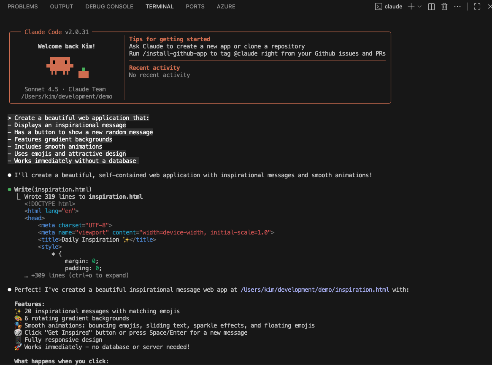

# Section 2: AI Agent Demo

## Overview

- Witness the power of AI-assisted development
- Recognize why programming fundamentals still matter
- Get inspired about what you'll be able to build

## What Are AI Agents?

### Definition

An **AI Agent** is an AI system that understands a goal and autonomously takes actions to complete tasks.
It follows a decision-making cycle — thinking based on human instructions, gathering necessary information, deciding what to do, and producing results.

💬 Difference from AI Chat

AI Chat: Conversational type.
It interacts with the user and provides answers or explanations.

AI Agent: Action-oriented type.
It receives instructions, uses multiple tools, and automatically **progresses through tasks**.

### Popular AI Agents for programming

In programming, it is becoming increasingly common to use AI agents.
There are various tools equipped with AI agents.

- **Claude** (by Anthropic) - Advanced reasoning and coding
- **ChatGPT** (by OpenAI) - Conversational AI with coding abilities
- **GitHub Copilot** - Code completion inside your editor
- **Cursor** - AI-powered code editor
- **v0** (by Vercel) - Generates React components

### How They Work

```
You describe what you want in natural language
        ↓
AI understands your request
        ↓
AI generates code
        ↓
You review and use the code
```

**Example conversation:**



## Today's Demo: Encouragement Message App

### What We'll Build

A beautiful web application that:
- Displays an inspirational message
- Has a button to show a new random message
- Features gradient backgrounds
- Includes smooth animations
- Uses emojis and attractive design
- Works immediately without a database

### Why This App?

**Perfect for demonstration:**
- ✅ Built in seconds
- ✅ Visually impressive
- ✅ No complex setup required
- ✅ Shows immediate results
- ✅ Easy to understand
- ✅ Demonstrates key concepts

**Not the learning project:**
- This is just for inspiration
- You'll learn with the Pet Management app
- That app will teach you fundamentals systematically

## Live Demonstration

**The instructor will now demonstrate building the app using an AI agent.**

### What to Watch For

1. **The prompt** - How the instructor asks the AI
2. **How it works** - AI thinks and automatically progresses through tasks
3. **The final result** - A fully functional app

### The Prompt Example 1

```
Create a beautiful web application that:
- Displays an inspirational message
- Has a button to show a new random message
- Features gradient backgrounds
- Includes smooth animations
- Uses emojis and attractive design
- Works immediately without a database
```

### The Prompt Example 2 (A little more complicated)

```
Create a Next.js page for an encouragement message app:
- Display one random encouraging message from a predefined list
- Show a button labeled "Need Encouragement!"
- When clicked, display a new random message
- Use a beautiful gradient background
- Add smooth fade-in animation when message changes
- Include relevant emojis with messages
- Make it centered and responsive
- Use Tailwind CSS for styling
- Make the design modern and uplifting
- Care about npm Supply Chain attacks(ignore scripts, audit, and so on)

```

## "Wow! So Why Learn Programming?"

### Great Question!

If AI can build apps this fast, why spend many days learning programming?

### Reasons You Still Need Programming Skills

#### 🧩 1. To Understand System Structure and Give Precise Requirements

Understanding programming allows you to make more realistic and efficient requests and modification instructions based on system structure and constraints.

This enables you to:

- Avoid unnecessary large-scale changes and achieve goals with minimal modifications
- Improve existing systems while mitigating change risks
- Make design decisions considering extensibility and maintainability, not just surface-level requirements

Furthermore, with structural understanding, you can give AI agents clear, logical, and consistent instructions rather than vague ones, improving AI output accuracy and reproducibility.

---

#### ⚙️ 2. To Prevent, Detect, and Respond to AI Errors

AI agents are powerful but not always accurate. They may make judgments based on incorrect assumptions or insufficient information, leading to logical contradictions and bugs.

Understanding programming allows you to:

- Verify and monitor AI output in advance to prevent errors
- Notice anomalies and bugs from runtime behavior and detect problems
- Identify root causes when bugs occur and fix them appropriately

This equips you with quality assurance, detection capabilities, and risk response skills when collaborating with AI. This power enables you to use AI safely and effectively with human judgment, rather than just depending on AI.

---

#### 🧭 3. To Complement AI's Weaknesses and Ensure Final Quality

AI agents excel at task automation, but human judgment remains essential in areas such as:

- Considering security and legal risks
- Ensuring consistency in system design and team development
- Planning architecture for long-term operation and scalability

Understanding programming allows you to properly evaluate and improve AI suggestions and generated code, ensuring final quality.

---

### What You'll Learn Through This Course Series

Through today's workshop and future lectures, you will gradually develop skills to:

- **Begin understanding system structure** - Start reading code structure and recognizing basic patterns
- **Learn to detect and fix simple errors** - Practice identifying common bugs and reading error messages
- **Develop decision-making foundations** - Build awareness of trade-offs and quality considerations
- **Improve communication with AI** - Practice giving clearer technical instructions over time
- **Start customizing code** - Begin making small modifications to existing code

**Note:** These skills develop gradually through practice. Today is the first step in a longer learning journey.

### Moving Forward

**Now that you're inspired**, let's set up your development environment so you can start building your own applications!

The next section will guide you through installing all the tools you need.

**Don't worry about the complexity** - we'll take it step by step, and by the end of today, you'll be writing code like what you just saw the AI generate.

---

**Navigation:**
- **Previous:** [← Section 1: Web Application Basics](01-web-application-basics.md)
- **Next:** [Section 3: Setup →](03-setup.md)
- **Home:** [README](../README.md)
