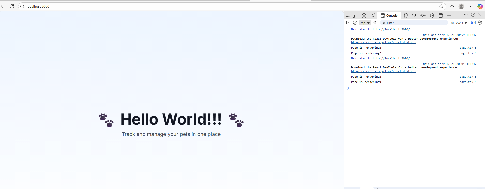

# 4.1 Hello World

## What You'll Learn

- Navigate the Next.js project structure
- Understand key files and folders
- Edit a file and see changes in the browser
- Use the browser developer tools

## Project Structure Overview

Let's explore the key files and folders in your project:

```
pet-management-starter/
├── app/                    # Main application code
│   ├── page.tsx           # Homepage (← We'll edit this!)
│   ├── layout.tsx         # Root layout wrapper
│   └── globals.css        # Global styles
├── components/            # Reusable UI components
├── lib/                   # Utility functions
├── public/                # Static files (images, etc.)
├── node_modules/          # Dependencies (don't touch!)
├── .env.local            # Environment variables (secret!)
├── .gitignore            # Files Git should ignore
├── package.json          # Project metadata and dependencies
├── next.config.js        # Next.js configuration
├── tsconfig.json         # TypeScript configuration
└── tailwind.config.ts    # Tailwind CSS configuration
```

##

 Key Folders

### `app/` Directory

This is where your application code lives. In Next.js 13+, this uses the **App Router**.

- **`page.tsx`** - The component for a page/route
- **`layout.tsx`** - Wraps pages with common UI (header, footer, etc.)
- **`globals.css`** - CSS that applies to the entire app

### `components/` Directory

Reusable pieces of UI that you use across pages.

**Example:** A `PetCard` component you use to display each pet.

### `public/` Directory

Static files served directly:
- Images: `/public/logo.png` → Access as `/logo.png`
- Icons, fonts, etc.

## Understanding `page.tsx`

Let's look at the homepage file.

### Open the File

1. In VSCode, navigate to `app/page.tsx`
2. Click to open it

You should see something like this:

```typescript
'use client'

export default function Home() {
  return (
    <main className="flex min-h-screen flex-col items-center justify-center p-24 bg-gradient-to-b from-blue-50 to-white">
      <div className="text-center">
        <h1 className="text-6xl font-bold text-gray-900 mb-4">
          🐾 Hello World 🐾
        </h1>
      </div>
    </main>
  )
}
```

### Let's Break It Down

```typescript
'use client'
```
- **`'use client'`** - This tells Next.js to run this component in the browser (client-side) rather than on the server
- Next.js uses server-side rendering by default, but we need client-side for interactive features
- **Important:** Keep this line at the top of your file in all exercises!

```typescript
export default function Home() {
```
- **`export default`** - Makes this function the default export of this file
- **`function Home()`** - Defines a function named "Home"
- **`()`** - No parameters (for now)

```typescript
  return (
```
- **`return`** - This function returns JSX (HTML-like syntax)
- **`(`** - Parentheses wrap multi-line returns

```typescript
    <main className="flex min-h-screen flex-col items-center justify-center p-24">
```
- **`<main>`** - HTML element for main content
- **`className`** - CSS classes (Tailwind utility classes)

```typescript
      <h1 className="text-4xl font-bold">Hello World</h1>
```
- **`<h1>`** - Heading element (largest heading)

```typescript
    </main>
  )
}
```
- **`</main>`** - Closing tag
- **`)`** - Close the return parentheses
- **`}`** - Close the function


## Understanding JSX

### What is JSX?

JSX stands for **JavaScript XML**. It looks like HTML but has some differences:

### HTML vs JSX

| HTML | JSX |
|------|-----|
| `class="text-center"` | `className="text-center"` |
| `` | `` |
| `for="input-id"` | `htmlFor="input-id"` |
| Lowercase attributes | camelCase attributes |

### Why `className`?

In JavaScript, `class` is a reserved keyword (used for defining classes), so JSX uses `className` instead.

### Self-Closing Tags

In JSX, tags with no children must be self-closing:

```typescript
// Wrong


// Right

```

### JavaScript in JSX

You can embed JavaScript expressions using curly braces `{}`:

```typescript
<h1>2 + 2 = {2 + 2}</h1>
// Displays: 2 + 2 = 4
```

We'll use this extensively in the next sections!

## Exercise 1: Change the Text

Let's make your first code change!

### Task

Change "Hello World" to "Hello Pet Management App"

### Steps

1. **Find the line** with `Hello World`
2. **Change the text** between the `>` and `</h1>`:

```typescript
<h1 className="text-6xl font-bold text-gray-900 mb-4">
  🐾 Hello Pet Management App!! 🐾
</h1>
```

3. **Save the file** (Ctrl+S / Cmd+S)
4. **Check your browser** at http://localhost:3000

You should immediately see the updated text!

### What Just Happened?

```
You edited the code
    ↓
Saved the file
    ↓
Next.js detected the change
    ↓
Recompiled the code
    ↓
Browser refreshed automatically
    ↓
New content displayed
```

This is called **Hot Module Replacement (HMR)** - changes appear instantly without full page reload!

## Exercise 2: Add More Content

Let's add a subtitle.

### Task

Add a paragraph below the heading.

### Steps

1. After the `</h1>` line, add a new line:

```typescript
<p className="text-xl text-gray-600 mt-4">
  Track and manage your pets in one place
</p>
```

2. Your code should now look like:

```typescript
export default function Home() {
  return (
    <main className="flex min-h-screen flex-col items-center justify-center p-24 bg-gradient-to-b from-blue-50 to-white">
      <div className="text-center">
        <h1 className="text-6xl font-bold text-gray-900 mb-4">
          🐾 Hello World 🐾
        </h1>
        <p className="text-xl text-gray-600 mt-4">
          Track and manage your pets in one place
        </p>
      </div>
    </main>
  )
}
```

3. **Save** and check the browser

## Using the Browser Developer Tools

Let's explore the tools that help you debug and understand your code.

### Opening DevTools

**Method 1:** Press `F12`
**Method 2:** Right-click on the page → "Inspect"
**Method 3 (Mac):** `Cmd + Option + I`

### The Console Tab

1. Click the **"Console"** tab
2. This is where `console.log()` output appears
3. This is also where error messages show up

### Try It

1. In `page.tsx`, add this line inside the function, before `return`:

```typescript
export default function Home() {
  console.log("Page is rendering!")

  return (
    // ... rest of the code
  )
}
```

2. **Save** and check the Console tab in DevTools
3. You should see: `Page is rendering!`


**Note:** You might see the message **twice**! This is because Next.js runs in **React Strict Mode** during development (`next dev`). Strict Mode intentionally renders components twice to help detect bugs and side effects. This is normal behavior and only happens in development - not in production builds.

**`console.log()` is your best friend for debugging!**

**Important:** Console logs are also crucial when debugging with AI agents (like Claude Code). When reporting errors to AI, sharing console log output helps get more accurate solutions. You'll learn this workflow in later sections, so get comfortable with using the console now!

### The Elements Tab

1. Click the **"Elements"** (or "Inspector") tab
2. You can see the HTML structure of your page
3. Hover over elements to see them highlighted on the page
4. Click the selector tool (top-left of DevTools) to inspect specific elements

## What's Next?

Now that you can navigate the project and make changes, you're ready to learn about **variables** - how to store and display data.

In the next section, you'll store pet information in variables and display it on screen!

---

**Navigation:**
- **Previous:** [← Section 4: Programming Basics](README.md)
- **Next:** [4.2 Variables & Assignment →](02-variables.md)
- **Home:** [README](../../README.md)
