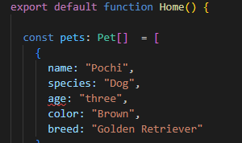

# 4.3 Data Structures

## What You'll Learn

- Primitive data types (string, number, boolean)
- Creating and accessing objects
- Working with arrays
- TypeScript type annotations
- Structuring complex data

## Primitive Data Types

JavaScript has several basic data types:

### String

Text enclosed in quotes:

```typescript
const petName = "Pochi"          // Double quotes
const petSpecies = 'Dog'          // Single quotes
const petDescription = `A ${petSpecies} named ${petName}` // Template literal
```

**Template literals** (backticks) allow embedded expressions:
```typescript
const greeting = `Hello, my name is ${petName}`
// Result: "Hello, my name is Pochi"
```

### Number

Integers or decimals (no distinction in JavaScript):

```typescript
const petAge = 3              // Integer
const petWeight = 25.5        // Decimal
const temperature = -10       // Negative
```

**Math operations:**
```typescript
const nextAge = petAge + 1           // Addition: 4
const dogYears = petAge * 7          // Multiplication: 21
const halfAge = petAge / 2           // Division: 1.5
const remainder = petAge % 2         // Modulo: 1
```

### Boolean

True or false values:

```typescript
const isVaccinated = true
const isHungry = false
const hasOwner = true
```

### Null and Undefined

Absence of value:

```typescript
const petOwner = null              // Intentionally empty
let petNickname                    // Undefined (not assigned)
```

## Objects

**Objects** group related data together using key-value pairs.

### The Problem Without Objects

```typescript
const petName = "Pochi"
const petSpecies = "Dog"
const petAge = 3
const petColor = "Brown"
// What if we have multiple pets? This doesn't scale!
```

### The Solution: Objects

```typescript
const pet = {
  name: "Pochi",
  species: "Dog",
  age: 3,
  color: "Brown"
}
```

### Object Syntax

```typescript
const objectName = {
  key1: value1,
  key2: value2,
  key3: value3
}
```

- **`{}`** - Object literal syntax
- **Keys** - Property names (like `name`, `species`)
- **`:`** - Separates key from value
- **`,`** - Separates key-value pairs

### Accessing Object Properties

#### Dot Notation (Most Common)

```typescript
const pet = {
  name: "Pochi",
  species: "Dog",
  age: 3
}

console.log(pet.name)     // "Pochi"
console.log(pet.species)  // "Dog"
console.log(pet.age)      // 3
```

#### Bracket Notation

```typescript
console.log(pet["name"])     // "Pochi"
console.log(pet["species"])  // "Dog"
```

Use bracket notation when:
- Property name is in a variable
- Property name has spaces or special characters

## Exercise 1: Create a Pet Object

### Task

Convert your pet variables into a single object.

### Steps

1. Open `app/page.tsx`

2. Replace the individual variables with an object:

```typescript
export default function Home() {
  const pet = {
    name: "Pochi",
    species: "Dog",
    age: 3,
    color: "Brown",
    breed: "Golden Retriever",
    isVaccinated: true
  }

  console.log("Pet object:", pet)
  console.log("Pet name:", pet.name)

  return (
    <main className="flex min-h-screen flex-col items-center justify-center p-24 bg-gradient-to-b from-blue-50 to-white">
      <div className="text-center">
        <h1 className="text-4xl font-bold mb-8">🐾 Pet Management App 🐾</h1>

        <div className="bg-white rounded-lg shadow-lg p-8 max-w-md">
          <h2 className="text-2xl font-semibold mb-4">
            {pet.species === "Dog" ? "🐕" : "🐱"} {pet.name}
          </h2>
          <p className="text-lg text-gray-700">Species: {pet.species}</p>
          <p className="text-lg text-gray-700">Age: {pet.age} years old</p>
          <p className="text-lg text-gray-700">Color: {pet.color}</p>
          <p className="text-lg text-gray-700">Breed: {pet.breed}</p>
          <p className="text-lg text-gray-700">
            Vaccinated: {pet.isVaccinated ? "Yes ✅" : "No ❌"}
          </p>
        </div>
      </div>
    </main>
  )
}
```

3. **Save** and check the browser

You should see all pet information displayed!

### Benefits of Objects

- Related data grouped together
- Easy to pass around (just pass `pet`)
- Clear structure and organization
- Can easily add/remove properties

## Arrays

**Arrays** are ordered lists of values.

### Why Arrays?

What if you have multiple pets?

```typescript
const pet1 = { name: "Pochi", species: "Dog", age: 3 }
const pet2 = { name: "Tama", species: "Cat", age: 5 }
const pet3 = { name: "Piyo", species: "Bird", age: 2 }
// This is tedious!
```

**Better solution:** Store them in an array!

```typescript
const pets = [
  { name: "Pochi", species: "Dog", age: 3 },
  { name: "Tama", species: "Cat", age: 5 },
  { name: "Piyo", species: "Bird", age: 2 }
]
```

### Array Syntax

```typescript
const arrayName = [value1, value2, value3]
```

- **`[]`** - Array literal syntax
- **`,`** - Separates values
- Values can be any type (strings, numbers, objects, even other arrays!)

### Examples

```typescript
const numbers = [1, 2, 3, 4, 5]
const names = ["Pochi", "Tama", "Piyo"]
const mixed = [1, "hello", true, { key: "value" }]
```

### Accessing Array Elements

Arrays are **zero-indexed** (first element is at index 0):

```typescript
const pets = ["Pochi", "Tama", "Piyo"]

console.log(pets[0])  // "Pochi" (first element)
console.log(pets[1])  // "Tama" (second element)
console.log(pets[2])  // "Piyo" (third element)
```

### Array Length

```typescript
const pets = ["Pochi", "Tama", "Piyo"]
console.log(pets.length)  // 3
```

### Array of Objects

The most common pattern in real applications:

```typescript
const pets = [
  {
    name: "Pochi",
    species: "Dog",
    age: 3,
    color: "Brown"
  },
  {
    name: "Tama",
    species: "Cat",
    age: 5,
    color: "Orange"
  },
  {
    name: "Piyo",
    species: "Bird",
    age: 2,
    color: "Yellow"
  }
]

// Access first pet
console.log(pets[0].name)  // "Pochi"

// Access second pet's species
console.log(pets[1].species)  // "Cat"
```

## Exercise 2: Create a Pets Array

### Task

Create an array of multiple pets.

### Steps

1. Replace your single `pet` object with an array of pets:

```typescript
export default function Home() {
  const pets = [
    {
      name: "Pochi",
      species: "Dog",
      age: 3,
      color: "Brown",
      breed: "Golden Retriever"
    },
    {
      name: "Tama",
      species: "Cat",
      age: 5,
      color: "Orange",
      breed: "Persian"
    },
    {
      name: "Piyo",
      species: "Bird",
      age: 2,
      color: "Yellow",
      breed: "Canary"
    },
    {
      name: "Masuo",
      species: "Fish",
      age: 1,
      color: "Blue",
      breed: "Betta"
    }
  ]

  console.log("All pets:", pets)
  console.log("First pet:", pets[0])
  console.log("Fourth pet:", pets[3])
  console.log("Number of pets:", pets.length)

  return (
    <main className="flex min-h-screen flex-col items-center justify-center p-24 bg-gradient-to-b from-blue-50 to-white">
      <div className="text-center">
        <h1 className="text-4xl font-bold mb-8">
          🐾 Pet Management App 🐾
        </h1>
        <p className="text-lg text-gray-600 mb-8">
          Managing {pets.length} pets
        </p>

        <div className="bg-white rounded-lg shadow-lg p-8 max-w-md">
          <h2 className="text-2xl font-semibold mb-4">
            {pets[3].name}
          </h2>
          <p className="text-lg text-gray-700">Species: {pets[3].species}</p>
          <p className="text-lg text-gray-700">Age: {pets[3].age} years old</p>
          <p className="text-lg text-gray-700">Color: {pets[3].color}</p>
          <p className="text-lg text-gray-700">Breed: {pets[3].breed}</p>
        </div>

        <p className="text-gray-500 mt-4">
          (We'll learn to display all pets in the Loops section!)
        </p>
      </div>
    </main>
  )
}
```

2. **Save** and check the browser

You should see:
- Total count of pets (4)
- Information for the first pet (Pochi) and fourth pet (Masuo)

3. **Try changing the index:**
   - Change `pets[3]` to `pets[2]` in the JSX
   - Save and see Piyo displayed instead!
   - Change back to `pets[3]`

## TypeScript Type Annotations

TypeScript lets you define the shape of your data.

### Defining a Type

```typescript
type Pet = {
  name: string
  species: string
  age: number
  color: string
  breed: string
  isVaccinated?: boolean  // ? means optional
}
```

### Using the Type

```typescript
const pet: Pet = {
  name: "Pochi",
  species: "Dog",
  age: 3,
  color: "Brown",
  breed: "Golden Retriever"
}
```

### Array Type Annotation

```typescript
const pets: Pet[] = [
  // Array of Pet objects
]
```

## Exercise 3: Add Type Safety

### Task

Add TypeScript type definitions for your pets.

### Steps

1. **Add a type definition above your component:**

```typescript
type Pet = {
  name: string
  species: string
  age: number
  color: string
  breed: string
}

export default function Home() {
  const pets: Pet[] = [
    {
      name: "Pochi",
      species: "Dog",
      age: 3,
      color: "Brown",
      breed: "Golden Retriever"
    },
    // ... other pets
  ]

  // ... rest of code
}
```

2. **Save** - it should work exactly the same

3. **Try breaking the type:**

```typescript
const pets: Pet[] = [
  {
    name: "Pochi",
    species: "Dog",
    age: "three",  // ❌ TypeScript error! Should be number
    color: "Brown",
    breed: "Golden Retriever"
  }
]
```

VSCode will show a red squiggle under `age` because the type doesn't match!



4. **Fix it back** to `age: 3`

### Benefits of TypeScript

- **Autocomplete**: VSCode suggests properties
- **Error detection**: Catches mistakes before runtime
- **Documentation**: Types document what data looks like
- **Refactoring**: Safely rename properties

### Try Autocomplete

1. Type `pets[0].` (with the dot)
2. VSCode shows all available properties
3. Select one from the list

This is TypeScript helping you!

## Nested Objects

Objects can contain other objects:

```typescript
const pet = {
  name: "Pochi",
  age: 3,
  owner: {
    name: "John",
    email: "john@example.com",
    phone: "555-1234"
  },
  address: {
    street: "123 Main St",
    city: "Tokyo",
    country: "Japan"
  }
}

// Accessing nested properties
console.log(pet.owner.name)           // "John"
console.log(pet.address.city)         // "Tokyo"
```

## Common Array Methods (Preview)

We'll explore these more in later sections:

```typescript
const pets = [...]

// Number of elements
pets.length                    // 4

// Add to end
pets.push({ name: "Goldie", ... })

// Remove from end
pets.pop()

// Add to beginning
pets.unshift({ name: "Rex", ... })

// Remove from beginning
pets.shift()

// Find index
pets.findIndex(pet => pet.name === "Pochi")  // 0

// Filter
const dogs = pets.filter(pet => pet.species === "Dog")

// Map (transform each element)
const names = pets.map(pet => pet.name)  // ["Pochi", "Tama", ...]
```

Don't worry about understanding these yet - we'll cover them when needed!

## Common Mistakes

### 1. Forgetting Commas in Objects

```typescript
// ❌ Wrong
const pet = {
  name: "Pochi"
  age: 3  // Missing comma!
}

// ✅ Right
const pet = {
  name: "Pochi",
  age: 3
}
```

### 2. Using Quotes for Keys (Usually Unnecessary)

```typescript
// ❌ Unnecessary
const pet = {
  "name": "Pochi",
  "age": 3
}

// ✅ Better
const pet = {
  name: "Pochi",
  age: 3
}
```

**Only use quotes if the key has spaces or special characters.**

### 3. Confusing Array Index

```typescript
const pets = ["Pochi", "Tama", "Piyo"]

console.log(pets[1])  // "Tama" (not "Pochi"!)
// Remember: arrays start at index 0!
```

## Checkpoint

You should now understand:

- ✅ Primitive types: string, number, boolean
- ✅ Creating and accessing objects
- ✅ Creating and accessing arrays
- ✅ Arrays of objects
- ✅ TypeScript type annotations
- ✅ Benefits of structured data

## What's Next?

You now have well-structured data (arrays of pet objects), but you're only displaying the first pet.

In the next section, you'll learn about **displaying data on screen** using JSX components and props, setting up for showing all pets in beautiful cards!

---

**Navigation:**
- **Previous:** [← 4.2 Variables & Assignment](02-variables.md)
- **Next:** [4.4 Displaying on Screen →](04-displaying-on-screen.md)
- **Home:** [README](../../README.md)
