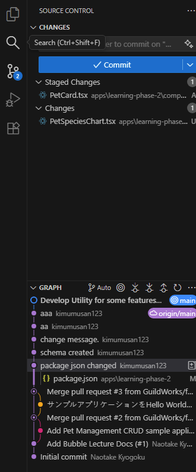
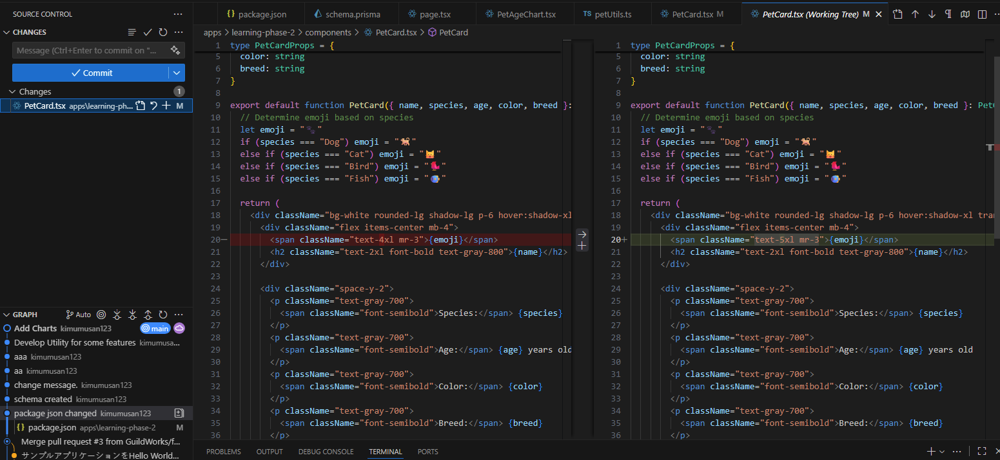
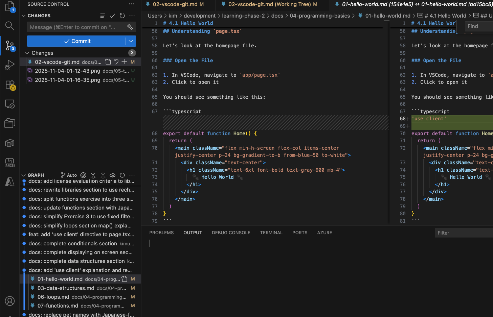
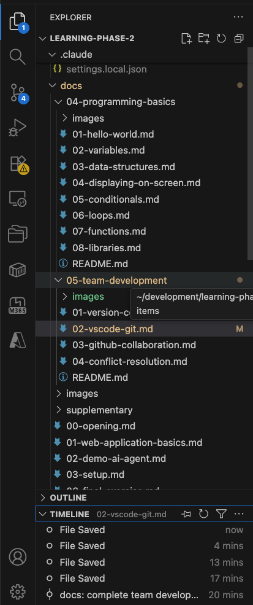
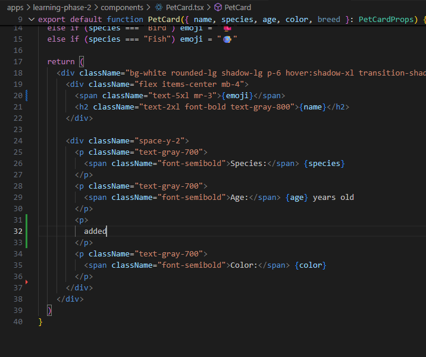
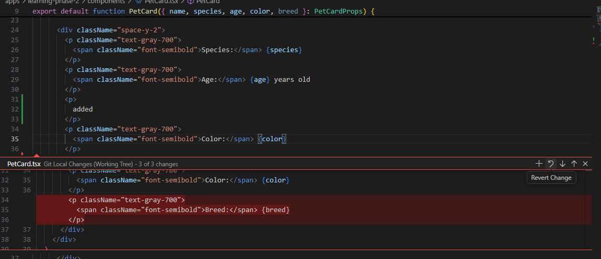
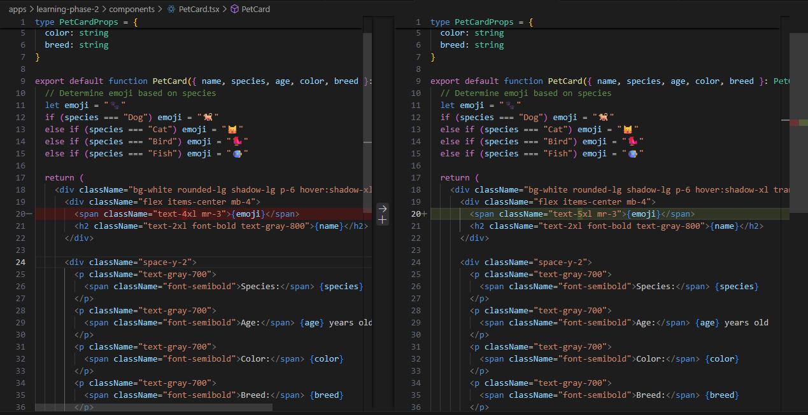
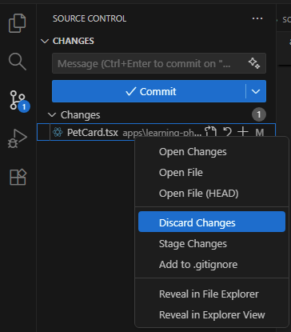

# 5.2 Working with VSCode Git

## Objectives

- Set up Git authentication in VSCode
- Learn VSCode's Source Control interface
- Practice staging, committing, and viewing history
- View commit history using VSCode's built-in features
- Understand when to discard changes

## Why Use VSCode for Git?

**VSCode has excellent Git integration built-in:**
- Visual interface - see changes at a glance
- Point-and-click operations - no commands to remember
- Diff viewer - see exactly what changed
- Conflict resolution UI - easier than command line
- Extensions available for advanced features

**You can do everything through the GUI!**

## VSCode Source Control Panel

### Opening Source Control

**Three ways:**
1. Click the Source Control icon in the left sidebar (looks like a branch)
2. Press `Ctrl+Shift+G` (Windows/Linux) or `Cmd+Shift+G` (Mac)
3. View → Source Control

### Panel Overview


```
┌─────────────────────────────┐
│ SOURCE CONTROL              │
├─────────────────────────────┤
│ Message (press Ctrl+Enter)  │  ← Commit message
├─────────────────────────────┤
│ ✓ Commit                    │  ← Commit button
├─────────────────────────────┤
│ Changes (3)                 │  ← Modified files
│   M components/PetCard.tsx  │
│   M app/page.tsx            │
│   ? newfile.ts              │
├─────────────────────────────┤
│ Staged Changes (0)          │  ← Files ready to commit
└─────────────────────────────┘
```

**File Status Indicators:**
- `M` = Modified
- `A` = Added (new file)
- `D` = Deleted
- `?` = Untracked (not in Git yet)
- `U` = Merge conflict

## Exercise 1: Make Your First Commit with VSCode

### Task

Make a small change to your project and commit it using VSCode.

### Steps

1. **Open your project** in VSCode

2. **Make a small change**
   - Open `components/PetCard.tsx`
   - Change the emoji size from `text-4xl` to `text-5xl`
   - Save the file (`Ctrl+S`)

3. **Open Source Control panel** (`Ctrl+Shift+G`)
   - You should see `PetCard.tsx` under "Changes"
   - `M` indicator shows it's modified

4. **View the changes**
   - Click on `PetCard.tsx` in the Changes list
   - VSCode opens a diff view:
     - Red: Old content (removed)
     - Green: New content (added)
   - See your emoji size change highlighted
     

5. **Stage the change**
   - Hover over `PetCard.tsx`
   - Click the `+` button (or right-click → Stage Changes)
   - File moves to "Staged Changes" section

   **What is staging?**
   - Marks which changes to include in the next commit
   - You can stage some files but not others
   - Like preparing a package before mailing it

6. **Write a commit message**
   - Click in the message box at the top
   - Type: `Increase pet emoji size for better visibility`
   - Good messages:
     - Start with a verb (Add, Fix, Update, Remove)
     - Be specific about what changed
     - Explain why if not obvious

7. **Commit**
   - Click the **✓ Commit** button
   - Or press `Ctrl+Enter` (Windows/Linux) or `Cmd+Enter` (Mac)

8. **Verify**
   - Changes section should now be empty
   - Your change is saved in Git history!

### Understanding What Happened

```
Working Directory → Staging Area → Local Repository
   (PetCard.tsx)      (git add)      (git commit)
    [Modified]         [Staged]       [Committed]
```

Your change is now:
- ✅ Saved in Git history
- ✅ Attributed to you
- ✅ Has a descriptive message
- ✅ Can be viewed or reverted later
- ❌ Not yet on GitHub (we'll push later)

## Viewing Git History

### Built-in Git History

**Source Control viewでグラフを表示:**

1. **Open Source Control panel** (`Ctrl+Shift+G`)
2. **Look at the commit list**
   - Visual graph showing branches and commits
   - Click on any commit to see details
   - Timeline view on the right
     

**Or use Timeline view:**

1. **Open any file** in editor
2. **Look at Explorer panel** (left sidebar)
3. **Find "Timeline" section** (bottom)
4. **See commit history** for that specific file
   

### What You'll See in History

```
○ a3f5b2c  Increase pet emoji size for better visibility  (You, 2 min ago)  [main]
○ 8d2e1a4  Add age categories to pet cards               (You, 1 hour ago)
○ 5c7f3b1  Create PetCard component                      (You, 2 hours ago)
```

**Each commit shows:**
- Commit hash (ID)
- Commit message
- Author and time
- Branch name

**Try:**
- Click a commit to see its changes
- Compare different commits
- Understand project evolution

## Viewing Changes Before Committing

### Inline Changes

VSCode shows changes right in your editor:

1. **Look for colored bars** in the left margin:
   - Green bar = Added lines
   - Red bar = Deleted lines
   - Blue bar = Modified lines


2. **Hover over a bar:**
   - See a popup with the old content
   - Options to revert or stage just those lines



### Diff View

Compare old vs new side-by-side:

1. **In Source Control panel**
2. **Click on a file** in Changes
3. **See split view:**
   - Left: Old version (before changes)
   - Right: New version (after changes)
   - Highlights show exactly what changed



## Exercise 2: Stage Multiple Files

### Task

Make changes to multiple files and practice selective staging.

### Steps

1. **Make changes to two files:**
   - `components/PetCard.tsx`: Change the emoji size from `text-5xl` to `text-4xl`
   - `app/page.tsx`: Change page title

2. **Open Source Control**
   - See both files in Changes

3. **Stage only PetCard.tsx**
   - Click `+` next to `PetCard.tsx`
   - Only this file moves to Staged Changes

4. **Commit the staged change**
   - Message: `Update PetCard emoji size again`
   - Click Commit

5. **Now stage page.tsx**
   - Click `+` next to `app/page.tsx`
   - Move to Staged Changes

6. **Commit this change**
   - Message: `Update page title`
   - Click Commit

**Why separate commits?**
- Each commit has one logical change
- Easier to understand history
- Easier to revert specific changes
- Professional practice

## Discarding Changes

Sometimes you want to throw away changes and start over.

### When to Discard

- Experimental code that didn't work
- Accidental changes
- Want to start fresh from last commit

### How to Discard in VSCode

**Discard all changes in a file:**
1. **In Source Control panel**
2. **Right-click** the file
3. **Select** "Discard Changes"
4. **Confirm** the prompt



**⚠️ Warning:** This permanently deletes your changes! They cannot be recovered.

**Discard specific lines:**
1. **Open the file** in editor
2. **Click** the colored bar in margin
3. **Click** "Revert Change" icon

### Exercise 3: Practice Discarding

1. **Make a change** to any file
2. **Don't commit it**
3. **Open Source Control**
4. **Discard the change**
5. **Verify** the file is back to its original state

**This is safe to practice - you haven't committed anything yet!**

## Common Workflows

### Daily Development Workflow

```
1. Start work
   ↓
2. Make changes
   ↓
3. Test your changes
   ↓
4. Stage changed files
   ↓
5. Write commit message
   ↓
6. Commit
   ↓
7. Repeat steps 2-6
```

### Frequency of Commits

**Commit often!**
- After fixing a bug
- After adding a feature
- After refactoring a function
- Before taking a break
- Before trying something risky

**Don't wait to commit:**
- ❌ At end of day
- ❌ When everything is perfect
- ❌ When feature is 100% complete

**Think of commits as save points in a video game!**

### Quick Actions

- **Stage All**: Click `+` next to "Changes"
- **Unstage All**: Click `-` next to "Staged Changes"
- **Refresh**: Click the refresh icon if changes don't appear

### "Authentication failed"

**Solution:**
1. Go to Accounts (bottom left)
2. Sign in to GitHub
3. Grant permissions

## Checkpoint

You should now be able to:

- ✅ Open VSCode Source Control panel
- ✅ See which files have changes
- ✅ View changes in diff view
- ✅ Stage files for commit
- ✅ Write good commit messages
- ✅ Commit changes
- ✅ View commit history using VSCode's built-in features
- ✅ Discard unwanted changes

## What's Next?

Now that you can make commits locally, you're ready to collaborate with your team!

In the next section, you'll learn how to **push** your commits to GitHub (sharing your work) and **pull** commits from GitHub (getting others' work). This is where team collaboration begins!

---

**Navigation:**
- **Previous:** [← 5.1 Version Control Basics](01-version-control.md)
- **Next:** [5.3 Collaborating with GitHub →](03-github-collaboration.md)
- **Home:** [README](../../README.md)
