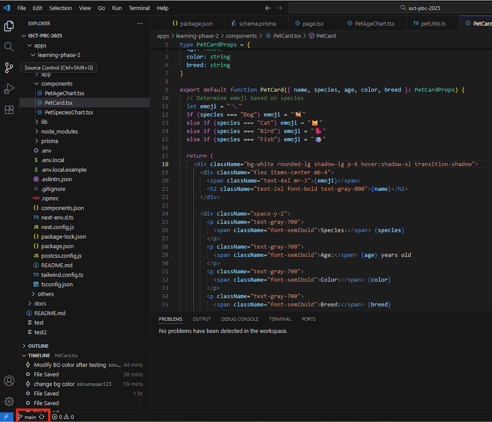

# 5.3 Collaborating with GitHub

## Objectives

- Understand local vs remote repositories
- Learn to push commits to GitHub
- Learn to pull commits from GitHub
- Invite team members to your repository
- Practice the commit-push-pull workflow
- Adopt best practices for small team collaboration

## Local vs Remote: Understanding the Setup

### The Two Locations

```
┌─────────────────────┐         ┌─────────────────────┐
│   Your Computer     │         │      GitHub         │
│   (Local Repo)      │  ←───→  │   (Remote Repo)     │
│                     │         │                     │
│  - Work here        │         │  - Share here       │
│  - Commit here      │         │  - Backup here      │
│  - Test here        │         │  - Collaborate here │
└─────────────────────┘         └─────────────────────┘
```

**Local Repository:**
- On your computer
- Where you write code
- Where you make commits
- Works offline
- Private to you

**Remote Repository (GitHub):**
- On GitHub's servers
- Where team shares code
- Always online
- Accessible to team members
- Acts as backup

### Why This Separation?

**Benefits:**
- Work offline (no internet needed for coding)
- Experiment safely (only share when ready)
- Fast operations (everything is local)
- Choose when to share (push when ready)
- Choose when to sync (pull when convenient)

**The Workflow:**
```
1. Pull (get latest from GitHub)
   ↓
2. Work locally (edit, test, commit)
   ↓
3. Push (share your commits to GitHub)
   ↓
4. Repeat
```

## Initial Setup: Configure Git Pull Strategy

**Before starting team collaboration, configure how Git handles divergent branches:**

### One-Time Setup

Open Terminal in VSCode and run:

```bash
git config pull.rebase false
```

**What this does:**
- Tells Git to create merge commits when branches diverge
- Prevents "divergent branches" errors
- Makes collaboration smoother

**Why you need this:**
When you and a teammate both make commits, your histories can diverge:
```
Your commits:     A---B---C
                      \
Teammate's:            D
```

With this setting, Git automatically creates a merge commit to combine both changes.

**Run this command once per repository!**

## Pushing: Sharing Your Work

**Push** = Upload your local commits to GitHub

### When to Push

Push your commits when:
- ✅ You've completed a feature
- ✅ You've fixed a bug
- ✅ You're done for the day
- ✅ You want to back up your work
- ✅ You want teammates to see your changes

**In our workshop:** Push frequently! At least every 30-60 minutes.

### How to Push in VSCode

**Sync Changes Button (Recommended)**

1. **Look at the bottom left** of VSCode
2. **Find the circular arrows icon** with a number
3. **Click it** to sync

**What the Sync button does automatically:**
1. First: **Pull** latest changes from GitHub
2. Then: **Push** your commits to GitHub
3. Both in one click!

**This is perfect because:**
- ✅ Always pulls before pushing (best practice!)
- ✅ Reduces conflicts
- ✅ Keeps you in sync with teammates
- ✅ No need to remember to pull separately

### What Happens When You Push

```
Before Push:
Local:    A---B---C---D
Remote:   A---B

After Push:
Local:    A---B---C---D
Remote:   A---B---C---D  ← Now in sync!
```

Your commits D and C are now on GitHub!

## Exercise 1: Push Your Changes to GitHub

### Task

Push the commits you made in the previous section to GitHub.

### Steps

1. **Make sure you have commits**
   - Open Source Control
   - See your recent commits
   - If none, make a small change and commit

2. **Click the Sync button**
   - Bottom left corner
   - Circular arrows icon
   - Shows number of commits to push

3. **Wait for completion**
   - VSCode shows progress
   - "Successfully pushed" message

4. **Verify on GitHub**
   - Go to your repository on GitHub.com
   - Click "Commits" (above file list)
   - See your commits there!
   - Click a commit to see changes

**Troubleshooting:**
- If push fails, you might need to pull first
- If authentication fails, sign in to GitHub in VSCode
- Ask instructor if stuck

## Pulling: Getting Others' Work

**Pull** = Download commits from GitHub to your computer

### When to Pull

Pull before:
- ✅ Starting work each day
- ✅ Before making big changes
- ✅ After teammate says "I pushed"
- ✅ When Git Graph shows remote is ahead

**In our workshop:** Pull before every work session!

### How to Pull in VSCode

**Sync Changes Button**

1. **Click** the sync icon (bottom left)
   

**What happens automatically:**
- First: **Pull** remote commits
- Then: **Push** your local commits (if any)
- Both operations in one click!

**Important:** The sync button always pulls first, so you don't need to worry about pushing before pulling. It handles the correct order automatically!

### What Happens When You Pull

```
Before Pull:
Local:    A---B---C
Remote:   A---B---C---D---E

After Pull:
Local:    A---B---C---D---E  ← Now has D and E!
Remote:   A---B---C---D---E
```

You now have commits D and E that your teammate made!

## Exercise 2: Pull Team Changes

### Task

One team member pushes, others pull to get the changes.

### Steps

**For the pusher:**
1. Make a small change (add a comment)
2. Commit with message: "Add comment for team test"
3. Push using sync button
4. Tell team: "I pushed!"

**For other team members:**
1. Click sync button
2. Open Git Graph - see the new commit!
3. Open the changed file - see the changes!

**Everyone:** Take turns being the pusher and puller.

## Inviting Team Members to Your Repository

For pair exercises and team projects, you'll need to give teammates access to your repository.

### Why Invite Team Members?

Without invitation:
- ❌ Teammates can't push to your repo
- ❌ They can only read public repos
- ❌ They can't collaborate directly

After invitation:
- ✅ Team can push commits
- ✅ Everyone works on same repo
- ✅ Full collaboration enabled

### How to Invite Team Members

1. **Go to your repository on GitHub**
   - Example: `github.com/your-username/isct-pbc-2025`

2. **Click "Settings"** (tab near the top)
   - If you don't see this, you're not the repo owner

3. **Click "Collaborators"** (left sidebar)
   - Under "Access" section
   - May need to confirm password

4. **Click "Add people"** (green button)

5. **Enter teammate's GitHub username or email**
   - Example: `hanako-tanaka`
   - Search finds matching users

6. **Click** their name from results

7. **Click "Add [username] to this repository"**

8. **Wait for teammate to accept**
   - They get an email invitation
   - Must click "Accept invitation"
   - Then they have push access!

### Accepting an Invitation

If someone invites you:

1. **Check your email** for invitation
2. **Click** the invitation link
3. **Click** "Accept invitation" on GitHub
4. **Done!** You now have access

**Or:** Go to the repository URL → click "Accept invitation" banner

## The Push-Pull Workflow

### Golden Rule

> **Always pull before you push!**

### Why This Matters

**Scenario:** You and teammate both work at the same time

```
Your computer:     A---B---C (your new commit)
GitHub:            A---B---D (teammate's new commit)
```

If you try to push C:
- ❌ Git rejects it
- ❌ Says "remote has changes you don't have"
- ❌ You must pull first

**Correct workflow:**
1. Pull (get D)
2. Git merges C and D automatically
3. Push (now includes both C and D)

### Daily Workflow

**Every work session:**
```
1. Open project
   ↓
2. Click sync button (pulls then pushes)
   ↓
3. Work & commit locally
   ↓
4. Click sync button (pulls then pushes)
   ↓
5. Repeat 2-4 throughout the day
```

## Exercise 3: Practice the Workflow

### Task

Practice the full workflow with your team.

### Setup

Form pairs or small groups (2-3 people).

### Round 1: Taking Turns

**Person A:**
1. Make a change to `app/page.tsx`
2. Commit: "Update page title"
3. Push

**Person B:**
1. Pull
2. Verify you see Person A's change
3. Make a change to `components/PetCard.tsx`
4. Commit: "Update pet card styling"
5. Push

**Person A:**
1. Pull
2. Verify you see Person B's change
3. Make another change
4. Commit and push

**Continue for some rounds**

### Round 2: Simultaneous Work

**Both people at the same time:**
1. Pull
2. Edit **different files**
3. Commit locally
4. One person pushes first
5. Other person:
   - Pull (gets first person's changes)
   - Push (now works!)

**This simulates real team development!**

## Best Practices for Small Teams

### 1. Communicate About Changes

**Before starting:**
- 💬 "I'm working on the PetCard component"
- 💬 "I'll modify the homepage"
- 💬 "I'm adding the delete feature"

**This prevents conflicts!**

### 2. Work on Different Files

**Good:**
- Person A: `components/PetCard.tsx`
- Person B: `components/AddPetForm.tsx`
- Person C: `app/page.tsx`

**Risky:**
- Everyone editing `app/page.tsx` at once

**If you must edit the same file:**
- Work on different sections
- Communicate about which lines
- Pull frequently

### 3. Commit & Push Frequently

**Recommended:**
- Commit every 30-60 minutes
- Push every 1-2 hours
- Push before lunch/breaks
- Push at end of day

**Why:**
- Smaller commits = easier to merge
- Frequent sharing = less conflicts
- Automatic backup
- Team stays in sync

### 4. Pull Before Starting Work

**Every time you:**
- Start coding
- Return from a break
- Resume after teammate pushes
- Are about to make big changes

### 5. Write Helpful Commit Messages

**Good messages help teammates:**
- ✅ "Add delete button with confirmation dialog"
- ✅ "Fix age calculation for leap years"
- ✅ "Update pet emoji sizes for mobile screens"

**Bad messages:**
- ❌ "Update"
- ❌ "Fix"
- ❌ "Changes"

Your teammate should understand what you did without looking at code!

### 6. Test Before Pushing

**Before you push:**
1. Run your app (`npm run dev`)
2. Test your changes
3. Make sure nothing broke
4. Then commit and push

**Don't push broken code!**

### 7. Pull Often During Long Work Sessions

**If working for several hours:**
- Pull every 30-60 minutes
- Even if you're not done with your feature
- Gets teammate changes early
- Prevents big merge conflicts later

## Checkpoint

You should now be able to:

- ✅ Understand local vs remote repositories
- ✅ Push commits to GitHub using sync button
- ✅ Pull commits from GitHub
- ✅ Invite team members to repository
- ✅ Accept repository invitations
- ✅ Follow push-pull workflow
- ✅ Work on different files with teammates
- ✅ Stay in sync with team

## What's Next?

You're now collaborating with your team! But what happens when you and a teammate edit the same part of a file?

In the next section, you'll learn about **merge conflicts** - what they are, why they happen, and how to resolve them using VSCode. Don't worry, they're not scary!

---

**Navigation:**
- **Previous:** [← 5.2 Working with VSCode Git](02-vscode-git.md)
- **Next:** [5.4 Handling Conflicts →](04-conflict-resolution.md)
- **Home:** [README](../../README.md)
