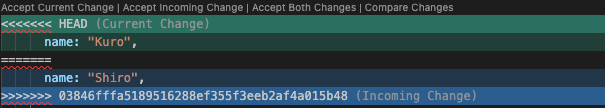

# 5.4 Handling Conflicts

## Objectives

- Understand why merge conflicts occur
- Recognize conflict markers in VSCode
- Resolve conflicts using VSCode's conflict resolution UI
- Practice creating and resolving conflicts with a partner
- Learn strategies to prevent conflicts

## What is a Merge Conflict?

A **merge conflict** occurs when you and a teammate edit the same lines of the same file, and Git can't automatically decide which version to keep.

### When Conflicts Happen

**Scenario:**
```
1. Taro and Hanako both pull the latest code
2. Both edit line 10 of PetCard.tsx
3. Taro pushes first
4. Hanako tries to push
   → Git says: "Pull first!"
5. Hanako pulls
   → Git says: "Conflict! You both edited line 10"
```

Git is asking: "Which version should I keep? You decide!"

### When Git CAN Auto-Merge (No Conflict)

**Different files:**
```
Taro edits:   components/PetCard.tsx
Hanako edits: app/page.tsx
✅ No conflict! Both changes kept automatically.
```

**Different lines in same file:**
```
Taro edits:   PetCard.tsx line 10
Hanako edits: PetCard.tsx line 50
✅ No conflict! Both changes kept automatically.
```

### When Git CANNOT Auto-Merge (Conflict!)

**Same lines in same file:**
```
Taro changes line 10:   const emoji = "🐕"
Hanako changes line 10: const emoji = "🐶"
❌ Conflict! Git doesn't know which to keep.
```

**Don't panic!** Conflicts are normal in team development. You'll learn to resolve them easily.

## Recognizing Conflicts in VSCode

### When You Pull and Get a Conflict

**VSCode shows:**
1. **Source Control panel:** "Merge conflicts" warning
2. **Conflicted files** marked with `!` or `C`
3. **Editor:** Conflict markers in the file

### Conflict Markers

When you open a conflicted file, you'll see special markers:


**What these mean:**
- `<<<<<<< HEAD`: Your version (what's in your current branch)
- `=======`: Separator
- `>>>>>>> 0384...`: Their version (what you're pulling from GitHub)

**The conflict markers are NOT code!** You need to remove them and choose what to keep.

## VSCode's Conflict Resolution UI

VSCode makes conflict resolution visual and easy!

### The Interface

When you open a conflicted file, VSCode shows:



**Four options appear above the conflict:**
1. **Accept Current Change**: Keep your version
2. **Accept Incoming Change**: Use teammate's version
3. **Accept Both Changes**: Keep both (one after another)
4. **Compare Changes**: See side-by-side diff

### Click to Resolve

Just **click** the option you want! VSCode will:
- Remove the conflict markers
- Keep the version you chose
- Mark the conflict as resolved

**That's it!** No command line needed.

## Exercise 1: Create and Resolve a Conflict (Pair Exercise)

### Task

Work with a partner to intentionally create a conflict, then resolve it using VSCode.

### Setup: Create a Test File

**Person A (only):**

1. Create `team-notes.md` in your project:
   ```markdown
   # Team Notes

   ## Today's Goal
   Build the pet management features

   ## Assigned Tasks
   - Feature 1: TBD
   - Feature 2: TBD
   ```

2. Stage and commit:
   - Open Source Control
   - Stage `team-notes.md`
   - Commit: "Add team notes file"

3. Push to GitHub:
   - Click sync button
   - Wait for success

**Person B:**

1. Pull the changes:
   - Click sync button
   - Verify you have `team-notes.md`

**Now both people have the same file!**

### Step 1: Both Edit the Same Line

**⚠️ Important:** Do these steps **at the same time**. Don't push yet!

**Person A:**
1. Open `team-notes.md`
2. Change line 4 to: `Build the pet management **dashboard**`
3. Stage and commit: "Update project goal"
4. **DO NOT push yet!**

**Person B (at the same time):**
1. Open `team-notes.md`
2. Change line 4 to: `Build the pet management **system**`
3. Stage and commit: "Specify project goal"
4. **DO NOT push yet!**

**Now you each have different changes to the same line!**

### Step 2: Person A Pushes First

**Person A:**
1. Click sync button
2. Your changes go to GitHub successfully
3. Tell Person B: "I pushed!"

### Step 3: Person B Gets the Conflict

**Person B:**
1. Click sync button
2. **VSCode shows:** "Merge conflicts detected"
3. **Source Control shows:** `team-notes.md` with conflict icon (`C` or `!`)
4. **Don't panic!** This is expected.

### Step 4: Person B Resolves the Conflict

**Person B:**

1. **Open `team-notes.md`**
   - VSCode shows conflict markers
   - See both versions highlighted

2. **Look at the options above the conflict:**
   ```
   Accept Current Change | Accept Incoming Change
     Accept Both Changes | Compare Changes
   ```

3. **Decide which to keep:**
   - Current = Your version ("system")
   - Incoming = Teammate's version ("dashboard")
   - Both = Keep both words
   - Compare = See side-by-side

4. **Click "Accept Currnet Change"**
   - Line becomes: `Build the pet management **system**`
   - Conflict markers disappear!
   - Or manually edit to: `Build the pet management **system**`

5. **Save the file** (`Ctrl+S`)

6. **Stage the resolved file:**
   - In Source Control
   - Click `+` to stage

7. **Commit the merge:**
   - Message: "Resolve merge conflict in team notes"
   - Click continue

8. **Push:**
   - Click sync button
   - Success!

### Step 5: Person A Pulls the Resolution

**Person A:**
1. Click sync button
2. Get Person B's merge commit
3. Open `team-notes.md`
4. See the resolved version!

**🎉 You successfully resolved a conflict!**

## Exercise 2: Practice More Conflicts

### Round 2: Opposite Roles

**This time:**
- Person B pushes first
- Person A gets the conflict
- Person A resolves it

**Same steps as before, but reversed!**

### Round 3: Multiple Conflicts

**Both people:**
1. Edit **two different lines** in `team-notes.md`
2. Also edit the **same line** again
3. Person A pushes
4. Person B pulls → 2 conflicts!
5. Person B resolves both conflicts (one at a time)
6. Person B pushes

**This shows:** You can have multiple conflicts in one file!

## Conflict Resolution Strategies

### Strategy 1: Accept Current

**Use when:**
- Your version is correct
- Teammate's change is outdated
- You discussed and agreed yours is right

**Example:**
```
<<<<<<< HEAD
const MAX_PETS = 10  ← Correct after discussion
=======
const MAX_PETS = 5   ← Old value
>>>>>>>
```

Click: **Accept Current Change**

### Strategy 2: Accept Incoming

**Use when:**
- Teammate's version is better
- They implemented a fix you didn't know about
- You discussed and agreed theirs is right

**Example:**
```
<<<<<<< HEAD
const email = user.email  ← Bug: can be undefined
=======
const email = user.email || "unknown"  ← Fixed version
>>>>>>>
```

Click: **Accept Incoming Change**

### Strategy 3: Accept Both

**Use when:**
- Both changes are needed
- Changes are additive (like adding different items to a list)

**Example:**
```
<<<<<<< HEAD
// Added by Taro
import { PetCard } from './components'
=======
// Added by Hanako
import { AddPetForm } from './components'
>>>>>>>
```

Click: **Accept Both Changes**

Result:
```typescript
import { PetCard } from './components'
import { AddPetForm } from './components'
```

### Strategy 4: Manual Edit

**Use when:**
- Need to combine changes carefully
- Both versions have issues
- Need a third solution

**How:**
1. Click in the conflict area
2. Delete the conflict markers manually
3. Type the correct code
4. Save

**Example conflict:**
```
<<<<<<< HEAD
<h1>Pet Dashboard</h1>
=======
<h1>Pet Management</h1>
>>>>>>>
```

**Manual solution:**
```typescript
<h1>Pet Management Dashboard</h1>
```

## Preventing Conflicts

Conflicts happen, but you can reduce them:

### 1. Communicate Before Coding

**In your team chat:**
- 💬 "I'm editing PetCard.tsx"
- 💬 "Working on the homepage"
- 💬 "Adding delete functionality to pet list"

If someone says they're editing a file, work on a different file!

### 2. Divide Work by Files

**Good division:**
```
Taro:   components/PetCard.tsx
Hanako: components/AddPetForm.tsx
Jiro:   app/page.tsx
```

Everyone works on different files → no conflicts!

### 3. Divide Work by Sections

**If you must edit the same file:**
```
PetCard.tsx:
- Taro: Header section (lines 1-20)
- Hanako: Body section (lines 21-50)
- Jiro: Footer section (lines 51-70)
```

Different sections → fewer conflicts!

### 4. Pull Frequently

**Before you start work:**
- Click sync button
- Get latest changes
- Then start coding

**During work (every 30-60 min):**
- Click sync button
- Merge small changes early
- Easier than one big merge later!

### 5. Commit Small Changes

**Instead of:**
- ❌ Work 4 hours → one giant commit → high conflict risk

**Do this:**
- ✅ Work 30 min → commit → pull → push → repeat
- Smaller changes → easier to merge

### 6. Push Completed Work

**When you finish a feature:**
1. Test it works
2. Commit
3. Pull (in case teammate pushed)
4. Resolve any conflicts
5. Push

**Don't leave unpushed code overnight!**

## What If You Get Stuck?

### Option 1: Abort the Merge

**If conflict is too complex:**

1. Open Source Control (`Ctrl+Shift+G`)
2. Click "..." (three dots)
3. Select "Merge: Abort"
4. Files return to pre-merge state
5. Discuss with teammate
6. Try again later

### Option 2: Ask for Help

**Don't struggle alone!**
- Ask teammate to pair-program the resolution
- Share screen and resolve together
- Ask mentor for guidance

### Option 3: Start Fresh (Last Resort)

**Only if really stuck:**

1. Copy your changes to a safe place
2. Discard local changes
3. Pull fresh from GitHub
4. Manually re-apply your changes
5. Commit and push

**This loses conflict history but gets you unstuck.**

## Understanding Merge Commits

After resolving conflicts, you make a **merge commit**.

### What's a Merge Commit?

```
Before merge:
A---B---C (your commits)
     \
      D---E (teammate's commits)

After merge:
A---B---C---F (merge commit)
     \     /
      D---E
```

**Merge commit F:**
- Combines both histories
- Contains conflict resolutions
- Has two parents (C and E)

**VSCode creates this automatically when you:**
1. Resolve conflicts
2. Stage resolved files
3. Commit

## Checkpoint

You should now be able to:

- ✅ Understand why conflicts occur
- ✅ Recognize conflict markers in VSCode
- ✅ Use VSCode's conflict resolution UI
- ✅ Resolve conflicts by accepting current/incoming/both
- ✅ Manually edit to create custom solutions
- ✅ Create conflicts intentionally for practice
- ✅ Complete merge commits after resolving
- ✅ Follow strategies to prevent conflicts

**Remember:** Conflicts are normal! Don't be afraid of them.

## What's Next?

Congratulations! You now know the fundamentals of team development with Git and GitHub:

- ✅ Understanding version control concepts
- ✅ Using VSCode Git GUI
- ✅ Collaborating through push/pull
- ✅ Resolving merge conflicts

**You're ready to build your project as a team!**

In your workshop, you'll apply these skills while developing your pet management application. The team development skills you learned here work for any software project.

**Good luck with your team project!** 🚀

---

**Navigation:**
- **Previous:** [← 5.3 Collaborating with GitHub](03-github-collaboration.md)
- **Next:** [Section 6: Summary & Q&A →](../06-summary.md)
- **Home:** [README](../../README.md)
